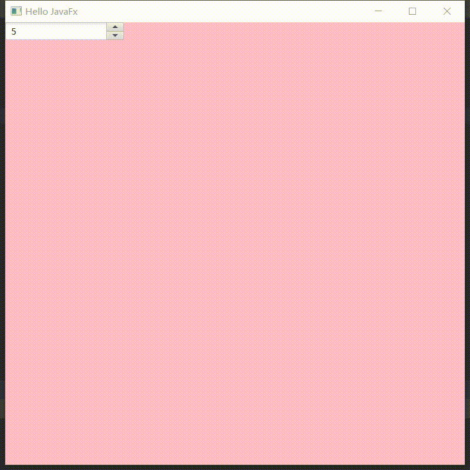
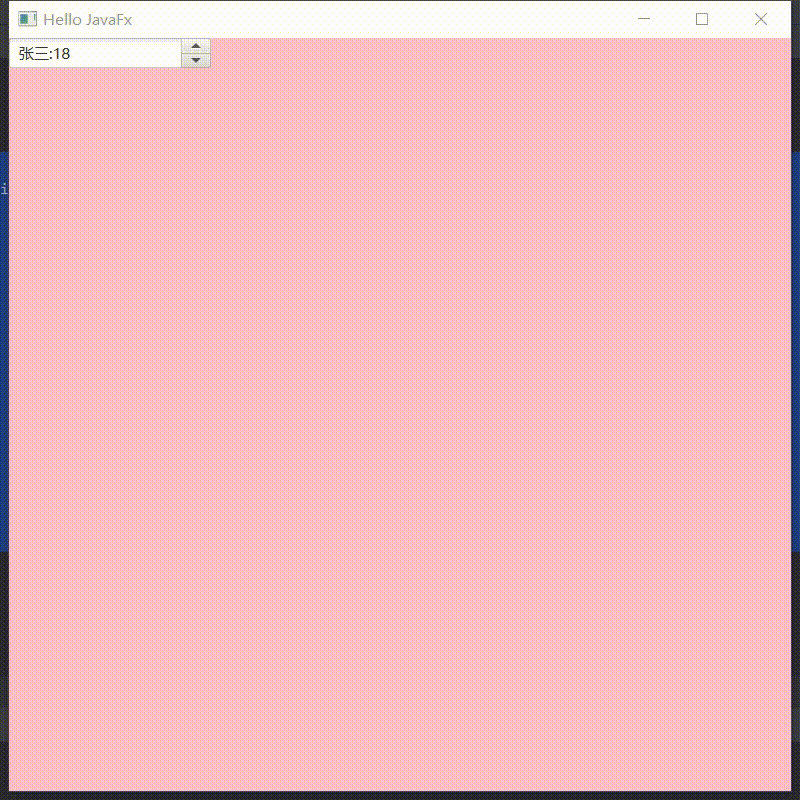
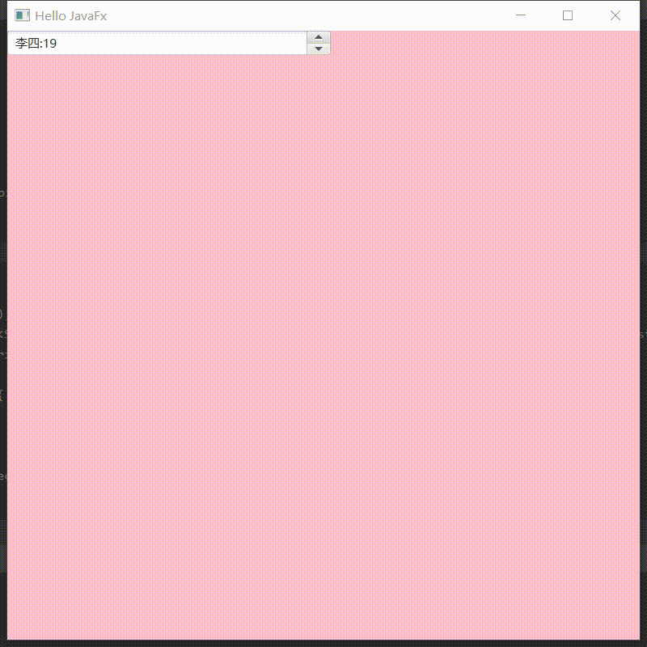

### Spinner微调器

#### 基本配置

* 设置可编辑`spinner.setEditable(true);`

* 设置箭头样式`spinner.getStyleClass().add(Spinner.STYLE_CLASS_ARROWS_ON_LEFT_HORIZONTAL);`

* 值改变监听事件
  
```java
spinner.valueProperty().addListener((observable, oldValue, newValue) -> {  
    System.out.println(newValue);  
});
```

#### 使用方式
1. 通过构造器传参创建
  
   ```java
   // 最小值，最大值，初始值，步长
   Spinner<Integer> spinner = new Spinner<Integer>(0,10,5,2);
   ```

   

2. 通过传入可观察列表创建
  
   ```java
   // 创建可观察列表
   ObservableList<String> list = FXCollections.observableArrayList();  
   list.addAll("A","B","C","D","E");  
   Spinner<String> spinner = new Spinner<>(list);
   ```
   
   

3. 使用内置的SpinnerValueFactory
  
   ```java
   // 创建学生类的可观察列表
   Student student1 = new Student("张三", 18);  
   Student student2 = new Student("李四", 19);  
   Student student3 = new Student("王五", 20);  
   ObservableList<Student> list = FXCollections.observableArrayList();  
   list.addAll(student1, student2, student3);
   // 创建内置的SpinnerValueFactory
   Spinner<Student> spinner = new Spinner<>();  
   SpinnerValueFactory.ListSpinnerValueFactory<Student> listSpinnerValueFactory = new SpinnerValueFactory.ListSpinnerValueFactory<>(list);  
   listSpinnerValueFactory.setConverter(new StringConverter<Student>() {  
       @Override  
       public String toString(Student object) {  
           if (object == null) {  
               return null;  
           }  
           return object.getName() + ":" + object.getAge();  
       }  
       @Override  
       public Student fromString(String string) {  
           return null;  
       }  
   });  
   spinner.setValueFactory(listSpinnerValueFactory);
   ```
   
   

4. 使用自定义的SpinnerValueFactory
  
   1. 自定义SpinnerValueFactory
     
      ```java
      class SVF extends SpinnerValueFactory<Student> {  
      
          private int index = -1;  
          private ObservableList<Student> list;  
      
          public SVF(ObservableList<Student> list) {  
              this.list = list;  
          }  
      
          @Override  
          public void decrement(int steps) {  
              System.out.println("decrement = " + steps);  
              index -= steps;  
              // 循环效果  
              if (index <= -1) {  
                  index = list.size() - 1;  
              }  
              this.setValue(list.get(index));  
          }  
      
          @Override  
          public void increment(int steps) {  
              System.out.println("increment = " + steps);  
              index += steps;  
              // 循环效果  
              if (index >= list.size()) {  
                  index = 0;  
              }  
              this.setValue(list.get(index));  
          }  
      }
      ```
   
   2. 使用自定义的SpinnerValueFactory
     
      ```java
      // 使用自定义的SpinnerValueFactory  
      Spinner<Student> spinner = new Spinner<>(list);  
      spinner.setEditable(true);  
      spinner.setPrefWidth(400);  
      SVF svf = new SVF(list);  
      svf.setConverter(new StringConverter<Student>() {  
          // 修改展示的数据  
          @Override  
          public String toString(Student object) {  
              if (object == null) {  
                  return null;  
              }  
              return object.getName() + ":" + object.getAge();  
          }  
          // 处理输入框传入的数据  
          @Override  
          public Student fromString(String string) {  
              if (string.equals("")) {  
                  return null;  
              }  
              String[] strings = string.split("[:]");  
              Student student;  
              if (strings.length < 2) {  
                  student = new Student(strings[0], 29);  
              } else {  
                  student = new Student(strings[0], Integer.parseInt(strings[1])  
      		}  
      		int index = list.indexOf(student);  
      		if (index == -1) {  
                  list.add(student);  
              }  
              return student;  
          }  
      });  
      spinner.setValueFactory(svf);  
      // 设置默认值，此设置只有在svf.setConverter和spinner.setValueFactory语句后才内调用其toString方法  
      svf.setValue(student1);  
      spinner.decrement(-3);  
      spinner.increment(2);
      ```
      
      
