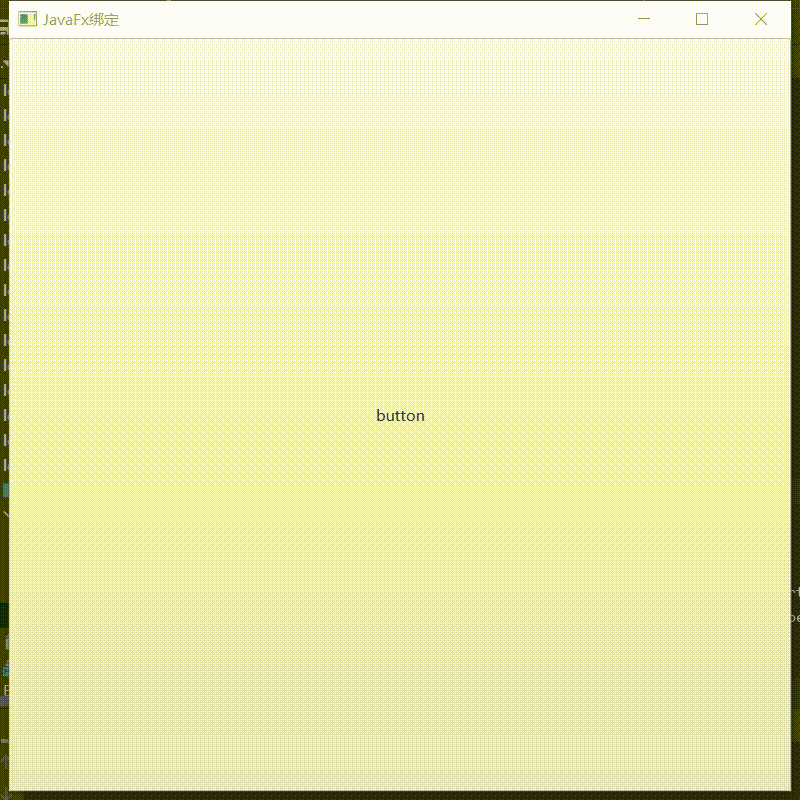
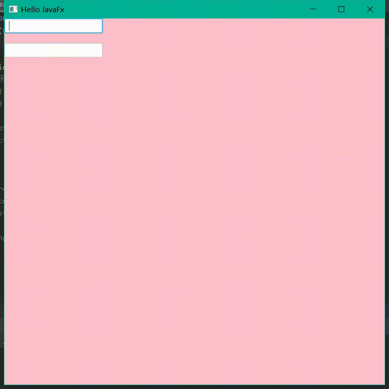
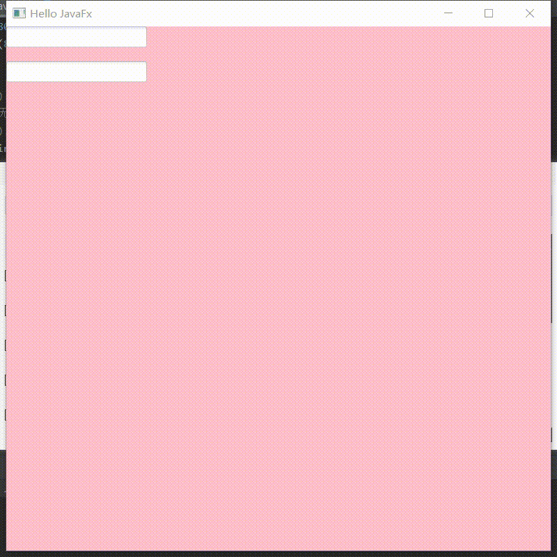
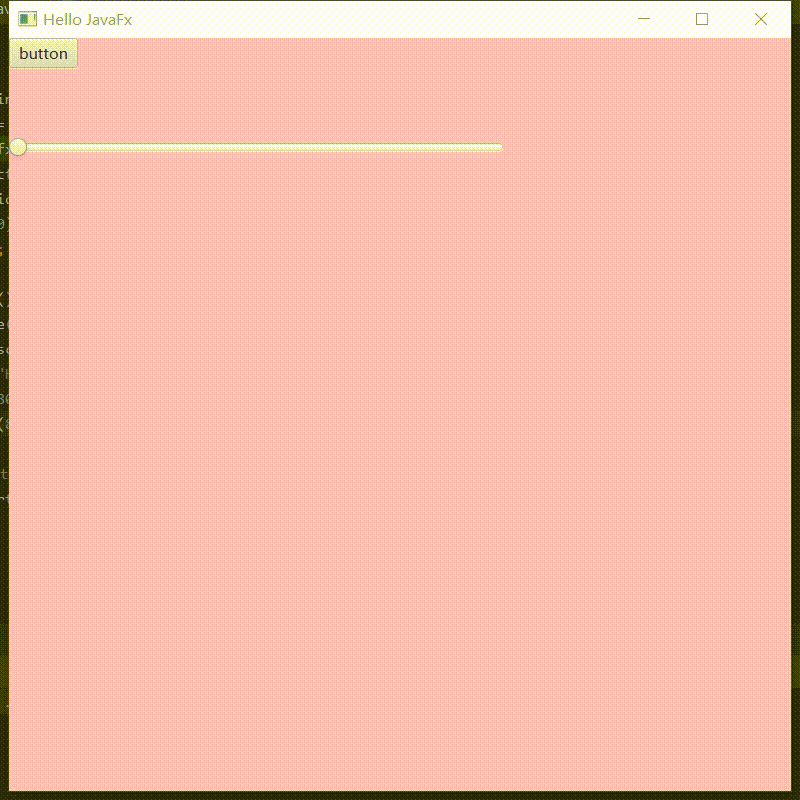

# 单向绑定和双向绑定

初始化两个监视属性

```java
SimpleIntegerProperty x = new SimpleIntegerProperty(1);  
SimpleIntegerProperty y = new SimpleIntegerProperty(5);
```

## 单向绑定

* x绑定y，绑定后x的数据会更新为y的数据`x.bind(y);`
  
   ```java
   System.out.println("x.get() = " + x.get());  
   System.out.println("y.get() = " + y.get());
   ```
   
   > x.get() = 5  
   > y.get() = 5

   ```java
   y.set(10);  
   System.out.println("x.get() = " + x.get());
   ```
   
   > x.get() = 10
   
   ```java
   x.set(9);
   ```
   
   > java.lang.RuntimeException: A bound value cannot be set.
   
   ```java
   // 判断是否被禁止修改值
   System.out.println("x.isBound() = " + x.isBound());  
   System.out.println("y.isBound() = " + y.isBound());
   ```
   
   > x.isBound() = true  
   > y.isBound() = false
   
   * 解绑`x.unbind();`
  
## 双向绑定

* x双向绑定y，绑定后x的数据会更新为y的数据`x.bindBidirectional(y);`
     
   ```java
   System.out.println("x.get() = " + x.get());  
   System.out.println("y.get() = " + y.get());
   ```
   
   > x.get() = 5
   > y.get() = 5
   
   ```java
   x.set(30);  
   System.out.println("x.get() = " + x.get());  
   System.out.println("y.get() = " + y.get());
   ```
   
   > x.get() = 30
   > y.get() = 30
   
   ```java
   System.out.println("x.isBound() = " + x.isBound());  
   System.out.println("y.isBound() = " + y.isBound());
   ```
   
   > x.isBound() = false
   > y.isBound() = false

* 解绑`x.unbindBidirectional(y);`或`y.unbindBidirectional(x);`
  
## 案例
1. 单向绑定实现按钮大小随界面大小改变而改变**使用prefWidthProperty，而不是widthProperty**
  
   ```java
   button.prefWidthProperty().bind(anchorPane.widthProperty());  
   button.prefHeightProperty().bind(anchorPane.heightProperty());
   ```

   

2. 双向绑定实现数据同步
  
   ```java
   text1.textProperty().bindBidirectional(text2.textProperty());
   ```

   
   重载方法
   
   ```java
   // 在文本框1中输入的文本会经过StringConverter处理，显示到文本框2；而文本框2输入的文本会直接显示到1，不经过StringConverter处理
   text1.textProperty().bindBidirectional(text2.textProperty(), new StringConverter<String>() {  
       @Override  
       public String toString(String object) {  
           return object;  
       }  
       @Override  
       public String fromString(String string) {  
           if (string.contains("5")) {  
               return string.replace("5", "五");  
           }  
           return string;  
       }  
   });
   ```
   
   

3. 单向绑定，按钮位置随进度条改变**使用translateXProperty，而不是LayoutXProperty**
  
   ```java
   button.translateXProperty().bind(slider.valueProperty());
   ```
   
   效果图
   