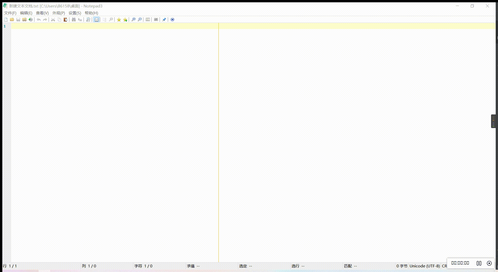

# Image

## 图片加载方式

1. 通过文件输入流加载
  
   ```java
   FileInputStream fileInputStream = new FileInputStream(new File("E:\\Users\\86158\\Document\\KDEShare\\1653719308635.gif"));  
   Image image = new Image(fileInputStream);
   ```

2. 其他方式加载
  
   ```java
   /*
       is – 从中加载图像的流
       requestedWidth – 图像的边界框宽度
       requestedHeight – 图像的边界框高度
       preserveRatio - 表示在缩放以适应指定边界框内的图像时是否保留原始图像的纵横比
       smooth - 指示在缩放此图像以适合指定边界框时是使用质量更好的过滤算法还是使用更快的过滤算法
    */
   Image image1 = new Image(fileInputStream, 100, 100, true, true);
   String path = "file:E:\\Users\\86158\\图片\\img.jpg";
   /*
       url – 表示用于获取像素数据的 URL 的字符串
       requestedWidth – 图像的边界框宽度
       requestedHeight – 图像的边界框高度
       preserveRatio - 表示在缩放以适应指定边界框内的图像时是否保留原始图像的纵横比
       smooth - 指示在缩放此图像以适合指定边界框时是使用质量更好的过滤算法还是使用更快的过滤算法
       backgroundLoading – 指示图像是否在后台加载
   */
   Image image2 = new Image(path, 400, 400, true, true, true);
   String path1 = "https://pic3.zhimg.com/80/v2-d91e417ebb04cd89c7a2171565d4f846_720w.jpg";
   /*
       url – 表示用于获取像素数据的 URL 的字符串
       requestedWidth – 图像的边界框宽度
       requestedHeight – 图像的边界框高度
       preserveRatio - 表示在缩放以适应指定边界框内的图像时是否保留原始图像的纵横比
       smooth - 指示在缩放此图像以适合指定边界框时是使用质量更好的过滤算法还是使用更快的过滤算法
       backgroundLoading – 指示图像是否在后台加载
   */
   // 加载网络图片最好使用异步加载
   Image image3 = new Image(path1, 400, 400, true, true, true);
   ImageView imageView = new ImageView(image3);
   anchorPane.getChildren().addAll(imageView);
   ```

## 获取图片属性

* 获取图片请求宽高
  
  ```java
  image.getRequestedHeight();
  image.getRequestedWidth();
  ```

* 获取图片实际宽高
  
  ```java
  image.getHeight();
  image.getWidth();
  ```

* 错误通知监听
  
  ```java
  image.errorProperty().addListener(new ChangeListener<Boolean>() {  
      @Override  
      public void changed(ObservableValue<? extends Boolean> observable, Boolean oldValue, Boolean newValue) {  
          System.out.println("newValue.booleanValue() = " + newValue.booleanValue());  
      }  
  });
  ```

* 加载进度通知**仅开启图片异步加载有效**
  
  ```java
  image.progressProperty().addListener(new ChangeListener<Number>() {  
      @Override  
      public void changed(ObservableValue<? extends Number> observable, Number oldValue, Number newValue) {  
          System.out.println("newValue.doubleValue() = " + newValue.doubleValue());  
          if (newValue.doubleValue() < 1.0) {  
              progressIndicator.setProgress(newValue.doubleValue());  
          }else {  
              anchorPane.getChildren().remove(progressIndicator);  
          }  
      }  
  });
  ```

* 异常通知
  
  ```java
  image.exceptionProperty().addListener(new ChangeListener<Exception>() {  
      @Override  
      public void changed(ObservableValue<? extends Exception> observable, Exception oldValue, Exception newValue) {  
          System.out.println("newValue.getMessage() = " + newValue.getMessage());  
      }  
  });
  ```
  
效果图
