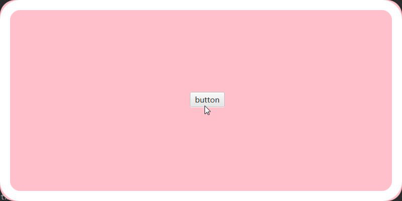

### 鼠标事件（拖拽案例）

#### 按钮拖拽

1. 获取鼠标按键按下时相对于按钮内部的坐标
  
   ```java
   button.setOnMousePressed(event -> {  
       sceneOfX = event.getX();  
       sceneOfY = event.getY();  
   });
   ```
2. 按钮随鼠标拖拽而移动
  
   ```java
   button.setOnMouseDragged(event -> {  
       // 不减则为左上角坐标  
       button.setLayoutX(event.getSceneX() - sceneOfX);  
       button.setLayoutY(event.getSceneY() - sceneOfY);  
   });
   ```
   
   效果图
   
   
   #### 窗口拖拽
3. 获得鼠标相对于窗口的坐标
  
   ```java
   scene.setOnMousePressed(event -> {  
       screenOfX = event.getScreenX() - primaryStage.getX();  
       screenOfY = event.getScreenY() - primaryStage.getY();  
   });
   ```
4. 窗口随鼠标拖拽而移动
  
   ```java
   scene.setOnMouseDragged(event -> {  
       primaryStage.setX(event.getScreenX() - screenOfX);  
       primaryStage.setY(event.getScreenY() - screenOfY);  
   });
   ```
   
   
   
#### 布局和窗口设置
* 设置布局样式
  
  ```java
  // 背景设置  
  String style = "-fx-background-color: pink; -fx-background-radius: 30; -fx-background-insets: 0;" +  
        // 边框设置  
        "-fx-border-color: white; -fx-border-style: SOLID; -fx-border-width: 20; -fx-border-radius: 30; -fx-border-insets: 0;";
  anchorPane.setStyle(style);
  ```
* 设置场景背景为白色透明`scene.setFill(Paint.valueOf("#ffffff00"));`

* 设置舞台窗口样式`primaryStage.initStyle(StageStyle.TRANSPARENT);`
  
  