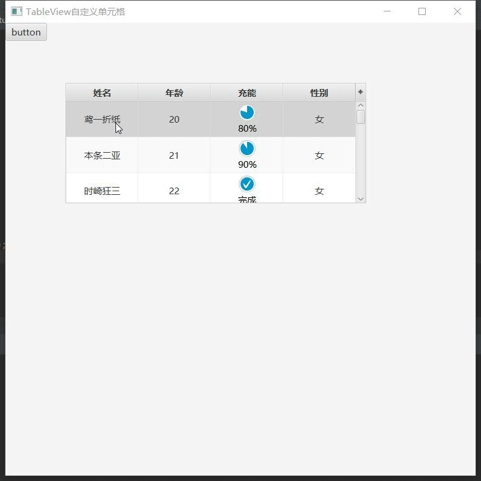

# TableView自定义单元格

1. 准备数据
  
   ```java
   StudentProperty student1 = new StudentProperty("鸢一折纸", 20, 80.0, false);  
   StudentProperty student2 = new StudentProperty("本条二亚", 21, 90.0, false);  
   StudentProperty student3 = new StudentProperty("时崎狂三", 22, 100.0, false);  
   StudentProperty student4 = new StudentProperty("冰芽川四糸乃", 23, 70.0, false);  
   StudentProperty student5 = new StudentProperty("五河琴里", 24, 60.0, false);  
   StudentProperty student6 = new StudentProperty("星宫六喰", 20, 80.0, false);  
   StudentProperty student7 = new StudentProperty("镜野七罪", 21, 90.0, false);  
   StudentProperty student8 = new StudentProperty("八舞夕弦", 22, 100.0, false);  
   StudentProperty student9 = new StudentProperty("八舞耶俱矢", 23, 70.0, false);  
   StudentProperty student10 = new StudentProperty("诱宵美九", 24, 60.0, false);  
   StudentProperty student11 = new StudentProperty("夜刀神十香", 24, 60.0, false);  
   ObservableList<StudentProperty> list = FXCollections.observableArrayList();  
   list.addAll(student1, student2, student3, student4, student5, student6, student7, student8, student9, student10, student11);  
   // 拷贝可观察列表  
   List<StudentProperty> listBackup = new ArrayList<>(list);  
   TableView<StudentProperty> tableView = new TableView<>(list);  
   tableView.setLayoutX(100);  
   tableView.setLayoutY(100);  
   tableView.setPrefWidth(500);  
   tableView.setPrefHeight(200);  
   tableView.setPlaceholder(new Text("None Data"));  
   // 选择性显示或隐藏某列
   tableView.setTableMenuButtonVisible(true);
   ```

2. 为实体类的每个属性创建列
  
   ```java
   TableColumn<StudentProperty, String> nameCol = new TableColumn<>("姓名");  
   nameCol.setCellValueFactory(new PropertyValueFactory<>("name"));  
   TableColumn<StudentProperty, Integer> ageCol = new TableColumn<>("年龄");  
   ageCol.setCellValueFactory(new PropertyValueFactory<>("age"));  
   TableColumn<StudentProperty, Double> scoreCol = new TableColumn<>("充能");  
   scoreCol.setCellValueFactory(new PropertyValueFactory<>("score"));  
   TableColumn<StudentProperty, Boolean> isBoyCol = new TableColumn<>("性别");  
   isBoyCol.setCellValueFactory(new PropertyValueFactory<>("gender"));  
   tableView.getColumns().add(nameCol);  
   tableView.getColumns().add(ageCol);  
   tableView.getColumns().add(scoreCol);  
   tableView.getColumns().add(isBoyCol);
   // 设置每列宽度相同（列拉长时挤占空间）  
   tableView.setColumnResizePolicy(TableView.CONSTRAINED_RESIZE_POLICY);
   ```

3. 自定义每一列的单元格

* 姓名列
  
  ```java
  nameCol.setCellFactory(new Callback<TableColumn<StudentProperty, String>, TableCell<StudentProperty, String>>() {  
      @Override  
      public TableCell<StudentProperty, String> call(TableColumn<StudentProperty, String> param) {  
          return new TableCell<StudentProperty, String>() {  
              String name = null;  
              @Override  
              protected void updateItem(String item, boolean empty) {  
                  super.updateItem(item, empty);  
                  if (empty || item == null) {  
                      return;  
                  }  
                  // 设置居中  
                  this.setAlignment(Pos.CENTER);  
                  name = item;  
                  initGraphic();  
              }  
              @Override  
              public void startEdit() {  
                  super.startEdit();  
                  TextField textField = new TextField(name);  
                  this.setGraphic(textField);  
                  // 回车提交事件  
                  textField.setOnKeyPressed(event -> {  
                      if (event.getCode() == KeyCode.ENTER) {  
                          commitEdit(textField.getText());  
                      }  
                  });  
              }  
              @Override  
              public void cancelEdit() {  
                  super.cancelEdit();  
                  initGraphic();  
              }  
              @Override  
              public void commitEdit(String newValue) {  
                  super.commitEdit(newValue);  
                  name = newValue;  
              }  
              private void initGraphic() {  
                  // 单元格文本居中  
                  Label label = new Label(name);  
                  this.setGraphic(label);  
              }  
          };  
      }  
  });
  ```

* 年龄列
  
  ```java
  ageCol.setCellFactory(new Callback<TableColumn<StudentProperty, Integer>, TableCell<StudentProperty, Integer>>() {  
      @Override  
      public TableCell<StudentProperty, Integer> call(TableColumn<StudentProperty, Integer> param) {  
          return new TableCell<StudentProperty, Integer>() {  
              Integer age = 0;  
              @Override  
              protected void updateItem(Integer item, boolean empty) {  
                  super.updateItem(item, empty);  
                  if (empty || item == null) {  
                      return;  
                  }  
                  this.setAlignment(Pos.CENTER);  
                  age = item;  
                  initGraphic();  
              }  
              @Override  
              public void startEdit() {  
                  super.startEdit();  
                  Spinner<Integer> spinner = new Spinner<>(0, 100, age);  
                  this.setGraphic(spinner);  
                  // 回车提交事件  
                  spinner.setOnKeyPressed(event -> {  
                      if (event.getCode() == KeyCode.ENTER) {  
                          commitEdit(spinner.getValue());  
                      }  
                  });  
              }  
              @Override  
              public void cancelEdit() {  
                  super.cancelEdit();  
                  initGraphic();  
              }  
              @Override  
              public void commitEdit(Integer newValue) {  
                  super.commitEdit(newValue);  
                  age = newValue;  
              }  
              private void initGraphic() {  
                  // 单元格文本居中  
                  Label label = new Label(age.toString());  
                  this.setGraphic(label);  
              }  
          };  
      }  
  });
  ```

* 分数列（不可编辑）
  
  ```java
  scoreCol.setCellFactory(new Callback<TableColumn<StudentProperty, Double>, TableCell<StudentProperty, Double>>() {  
      @Override  
      public TableCell<StudentProperty, Double> call(TableColumn<StudentProperty, Double> param) {  
          return new TableCell<StudentProperty, Double>() {  
              @Override  
              protected void updateItem(Double item, boolean empty) {  
                  super.updateItem(item, empty);  
                  if (empty || item == null) {  
                      return;  
                  }  
                  ProgressIndicator progressIndicator = new ProgressIndicator(item / 100);  
                  this.setGraphic(progressIndicator);  
              }  
          };  
      }  
  });
  ```

* 性别列
  
  ```java
  isBoyCol.setCellFactory(new Callback<TableColumn<StudentProperty, Boolean>, TableCell<StudentProperty, Boolean>>() {  
      @Override  
      public TableCell<StudentProperty, Boolean> call(TableColumn<StudentProperty, Boolean> param) {  
          return new TableCell<StudentProperty, Boolean>() {  
              Boolean gender = false;  
              @Override  
              protected void updateItem(Boolean item, boolean empty) {  
                  super.updateItem(item, empty);  
                  this.setAlignment(Pos.CENTER);  
                  if (empty) {  
                      return;  
                  }  
                  gender = item;  
                  initGraphic();  
              }  
              @Override  
              public void startEdit() {  
                  super.startEdit();  
                  ComboBox<Boolean> comboBox = new ComboBox<>();  
                  comboBox.setPromptText(gender ? "男" : "女");  
                  comboBox.setConverter(new StringConverter<Boolean>() {  
                      @Override  
                      public String toString(Boolean object) {  
                          return object ? "男" : "女";  
                      }  
                      @Override  
                      public Boolean fromString(String string) {  
                          return null;  
                      }  
                  });  
                  comboBox.getItems().addAll(true, false);  
                  this.setGraphic(comboBox);  
                  // 回车提交事件  
                  comboBox.setOnKeyPressed(event -> {  
                      if (event.getCode() == KeyCode.ENTER) {  
                          commitEdit(comboBox.getValue());  
                      }  
                  });  
              }  
              @Override  
              public void cancelEdit() {  
                  super.cancelEdit();  
                  initGraphic();  
              }  
              @Override  
              public void commitEdit(Boolean newValue) {  
                  super.commitEdit(newValue);  
                  gender = newValue;  
              }  
              private void initGraphic() {  
                  Label label = new Label(gender ? "男" : "女");  
                  this.setGraphic(label);  
              }  
          };  
      }  
  });
  ```
  
  效果图
  