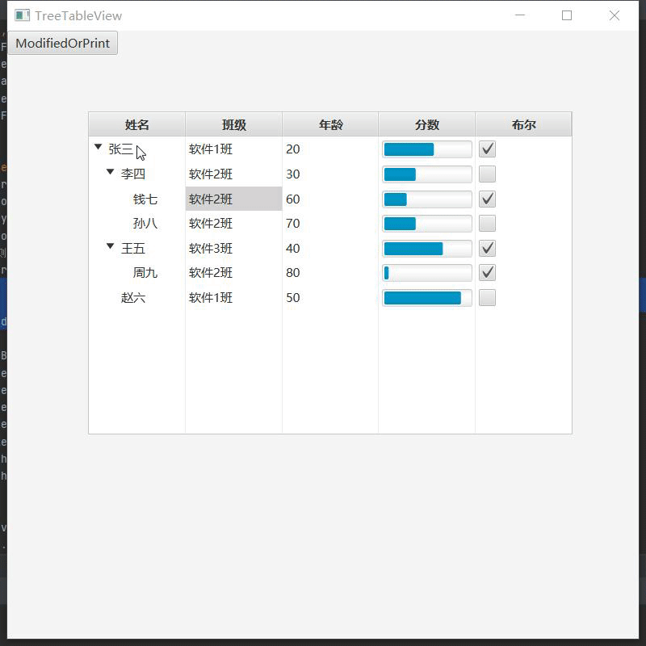

### TreeTableView五种内置Cell

1. 实体类定义
  
   ```java
   /**  
   * 优化后的Data类  
   *  
   * @author reine  
   * 2022/6/8 8:55  
   */  
   public class Data {  
       /**  
     * 使用ReadOnlyXXXWrapper类型的属性来声明属性，这样可以避免属性的设置和读取  
     */  
       private ReadOnlyStringWrapper name = new ReadOnlyStringWrapper();  
       private ReadOnlyStringWrapper clazz = new ReadOnlyStringWrapper();  
       private ReadOnlyIntegerWrapper age = new ReadOnlyIntegerWrapper();  
       private ReadOnlyDoubleWrapper score = new ReadOnlyDoubleWrapper();  
       /**
     * 这个属性由于使用CheckBox进行展示，必须使用SimpleXXXProperty定义
     */
       private SimpleBooleanProperty male = new SimpleBooleanProperty();  
       public Data() {  
       }  
       public Data(String name, String clazz, Integer age, Double score, Boolean male) {  
           this.name.set(name);  
           this.clazz.set(clazz);  
           this.age.set(age);  
           this.score.set(score);  
           this.male.set(male);  
       }  
       public String getName() {  
           return name.get();  
       }  
       public ReadOnlyStringProperty nameProperty() {  
           return name.getReadOnlyProperty();  
       }  
       public void setName(String name) {  
           this.name.set(name);  
       }  
       public String getClazz() {  
           return clazz.get();  
       }  
       public ReadOnlyStringProperty clazzProperty() {  
           return clazz.getReadOnlyProperty();  
       }  
       public void setClazz(String clazz) {  
           this.clazz.set(clazz);  
       }    
       public int getAge() {  
           return age.get();  
       }  
       public ReadOnlyIntegerProperty ageProperty() {  
           return age.getReadOnlyProperty();  
       }  
       public void setAge(int age) {  
           this.age.set(age);  
       }  
       public boolean isMale() {  
           return male.get();  
       }  
       public SimpleBooleanProperty maleProperty() {  
           return male;  
       }  
       public void setMale(boolean male) {  
           this.male.set(male);  
       }  
       public double getScore() {  
           return score.get();  
       }  
       public ReadOnlyDoubleProperty scoreProperty() {  
           return score.getReadOnlyProperty();  
       }  
       public void setScore(double score) {  
           this.score.set(score);  
       }  
   }
   ```
2. TreeTableColumn设置
  
   ```java
   TreeTableColumn<Data, String> nameCol = new TreeTableColumn<>("姓名");  
   TreeTableColumn<Data, String> clazzCol = new TreeTableColumn<>("班级");  
   TreeTableColumn<Data, Integer> ageCol = new TreeTableColumn<>("年龄");  
   TreeTableColumn<Data, Double> scoreCol = new TreeTableColumn<>("分数");  
   TreeTableColumn<Data, Boolean> maleCol = new TreeTableColumn<>("布尔");  
   nameCol.setCellValueFactory(new TreeItemPropertyValueFactory<>("name"));  
   clazzCol.setCellValueFactory(new TreeItemPropertyValueFactory<>("clazz"));  
   ageCol.setCellValueFactory(new TreeItemPropertyValueFactory<>("age"));  
   scoreCol.setCellValueFactory(new TreeItemPropertyValueFactory<>("score"));  
   maleCol.setCellValueFactory(new TreeItemPropertyValueFactory<>("male"));
   // 加载列  
   view.getColumns().addAll(nameCol, clazzCol, ageCol, scoreCol, maleCol);
   ```
3. 内置的五种TreeTableCell
  
   ```java
   view.setEditable(true);  
   nameCol.setCellFactory(TextFieldTreeTableCell.forTreeTableColumn());  
   clazzCol.setCellFactory(ComboBoxTreeTableCell.forTreeTableColumn("软件1班", "软件2班", "软件3班"));  
   ageCol.setCellFactory(ChoiceBoxTreeTableCell.forTreeTableColumn(18, 19, 20, 21, 22, 23));  
   scoreCol.setCellFactory(ProgressBarTreeTableCell.forTreeTableColumn());  
   // 此处如果要正常显示，则实体类中必须使用SimpleBooleanProperty定义该属性  
   maleCol.setCellFactory(CheckBoxTreeTableCell.forTreeTableColumn(new TreeTableColumn<>()));
   ```
   
   效果图
   