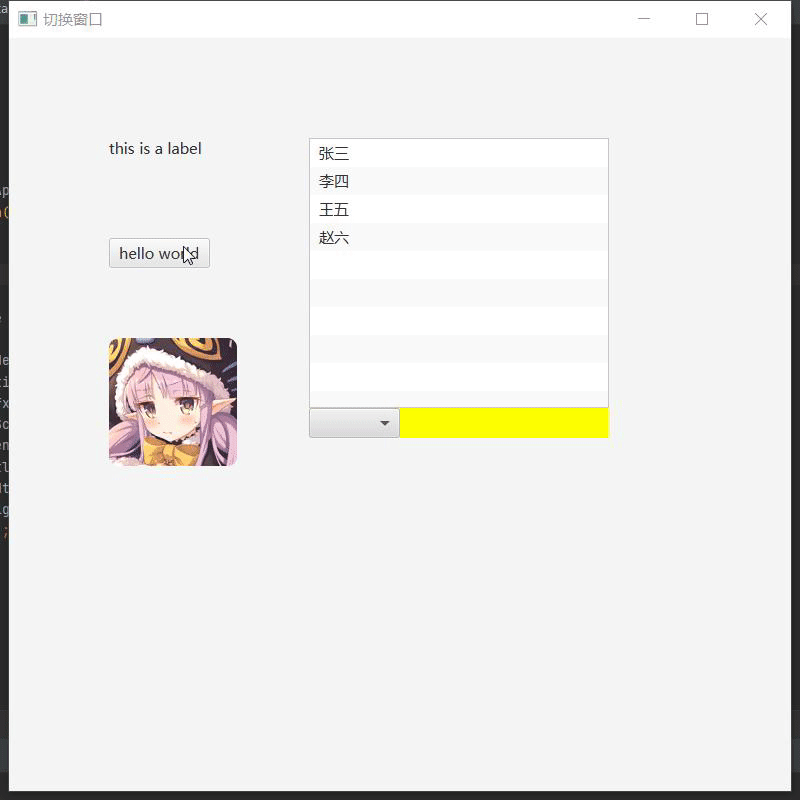

# fxml切换窗口

1. 进入窗口

   ```xml
   <?xml version="1.0" encoding="UTF-8"?> 
   <?import javafx.collections.FXCollections?>
   <?import javafx.scene.control.Button?>  
   <?import javafx.scene.control.ComboBox?>  
   <?import javafx.scene.control.Label?>  
   <?import javafx.scene.control.ListView?>  
   <?import javafx.scene.image.Image?>  
   <?import javafx.scene.image.ImageView?>  
   <?import javafx.scene.layout.*?>  
   <?import java.lang.*?>  
   <AnchorPane xmlns="http://javafx.com/javafx"  
               xmlns:fx="http://javafx.com/fxml"  
               fx:controller="com.reine.controller.Data">  
       <children>  
           <Label text="this is a label" AnchorPane.topAnchor="100" AnchorPane.leftAnchor="100">  
           </Label>  
           <!--几种显示文本的方法，1.标签内，2.子节点<text>xxx</text>、<String fx:value="xxx"/>、<Double fx:value="xxx"/>-->  
           <Button fx:id="button" AnchorPane.topAnchor="200" AnchorPane.leftAnchor="100" text="hello world" onAction="#showNewStage">  
           </Button>  
           <!--可以使用image属性或者Image标签-->  
           <ImageView AnchorPane.topAnchor="300" AnchorPane.leftAnchor="100">  
               <!--必须将图片/文件夹放到static目录下，使用@符号引用资源文件-->  
               <Image url="@/static/images/logo.png"/>  
           </ImageView>  
           <BorderPane layoutX="300" layoutY="100"  
                       style="-fx-background-color: yellow;"  
                       prefWidth="300" prefHeight="300">  
               <center>  
                   <ListView fx:id="listview" prefWidth="200" prefHeight="200"/>  
               </center>  
               <bottom>  
                   <ComboBox>  
                       <items>  
                           <FXCollections fx:factory="observableArrayList">  
                               <String fx:value="data1"/>  
                               <String fx:value="data2"/>  
                               <String fx:value="data3"/>  
                               <String fx:value="data4"/>  
                               <String fx:value="data5"/>  
                           </FXCollections>  
                       </items>  
                   </ComboBox>  
               </bottom>  
           </BorderPane>  
       </children>  
   </AnchorPane>
   ```

2. 控制类
  
   ```java
   public class Data {  
       @FXML  
       private Button button;  
       @FXML  
       private ListView<String> listview;  
       @FXML  
       private void initialize() {  
           ObservableList<String> list = FXCollections.observableArrayList();  
           list.addAll("张三", "李四", "王五", "赵六");  
           listview.setItems(list);  
           listview.getSelectionModel().selectedItemProperty().addListener((observable, oldValue, newValue) -> {  
               System.out.println("newValue = " + newValue);  
           });  
       }  
       public void showNewStage(ActionEvent actionEvent) {  
           System.out.println("click");  
           FXMLLoader loader = new FXMLLoader();  
           loader.setLocation(loader.getClassLoader().getResource("fxml/other.fxml"));  
           Scene scene = null;  
           try {  
               BorderPane pane = loader.load();  
               scene = new Scene(pane);  
           } catch (IOException e) {  
               e.printStackTrace();  
           }  
           // 获取按钮所在的窗口  
           Stage originStage = (Stage) button.getScene().getWindow();  
           Stage stage = new Stage();  
           stage.setScene(scene);  
           stage.setWidth(300);  
           stage.setHeight(300);  
           // 设置模态  
           stage.initOwner(originStage);  
           stage.initModality(Modality.APPLICATION_MODAL);  
           stage.show();  
       }  
   }
   ```

3. 进行切换的窗口

   ```xml
   <?xml version="1.0" encoding="UTF-8"?> 
   <?import javafx.scene.image.Image?>
   <?import javafx.scene.image.ImageView?>  
   <?import javafx.scene.layout.BorderPane?>  
   <BorderPane xmlns="http://javafx.com/javafx">  
       <center>  
           <!--可以使用image属性或者Image标签-->  
           <ImageView>  
               <!--必须将图片/文件夹放到static目录下，使用@符号引用资源文件-->  
               <Image url="@/static/images/logo.png"/>  
           </ImageView>  
       </center>  
   </BorderPane>
   ```

4. 程序入口类

   ```java
   public class Main extends Application {  
       public static void main(String[] args) {  
           launch(args);  
       }  
       @Override  
       public void start(Stage primaryStage) throws Exception {  
           FXMLLoader fxmlLoader = new FXMLLoader();  
           fxmlLoader.setLocation(fxmlLoader.getClassLoader().getResource("fxml/data.fxml"));  
           AnchorPane root = fxmlLoader.load();  
           Scene scene = new Scene(root);  
           primaryStage.setScene(scene);  
           primaryStage.setTitle("切换窗口");  
           primaryStage.setWidth(800);  
           primaryStage.setHeight(800);  
           primaryStage.show();  
       }  
   }
   ```

