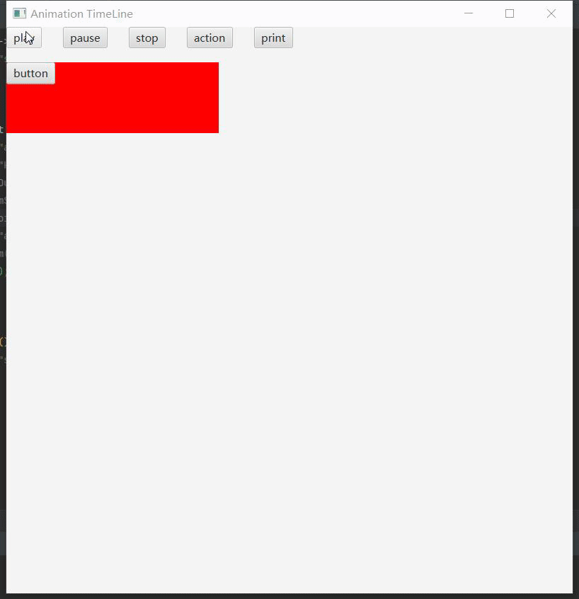

### Animation动画 Timeline

##### 按钮组

```java
ToggleButton play = new ToggleButton("play");  
ToggleButton pause = new ToggleButton("pause");  
ToggleButton stop = new ToggleButton("stop");  
ToggleButton action = new ToggleButton("action");  
ToggleButton print = new ToggleButton("print");  
ToggleGroup toggleGroup = new ToggleGroup();  
play.setToggleGroup(toggleGroup);  
pause.setToggleGroup(toggleGroup);  
stop.setToggleGroup(toggleGroup);  
action.setToggleGroup(toggleGroup);  
print.setToggleGroup(toggleGroup);  
HBox hBox = new HBox(30);  
hBox.getChildren().addAll(play, pause, stop, action, print);
```

#### 动画

* 创建时间线动画，帧率为60（默认）`Timeline timeline = new Timeline(60);`

* 创建时间点
  
```java
// kf1配合kf2，效果是原点位置从0水平移动300
// kf2配合kf3，效果是从(300,0)位置垂直移动100
KeyValue keyValue1 = new KeyValue(button.translateXProperty(), 0);// 要改变的监视属性，改变后的属性值  
KeyValue keyValue1y = new KeyValue(button.translateYProperty(), 0);  
KeyFrame kf1 = new KeyFrame(Duration.seconds(0), "kf1", new EventHandler<ActionEvent>() {  
    @Override  
    public void handle(ActionEvent event) {  
        System.out.println("kf1");  
    }  
}, keyValue1, keyValue1y);// 动画开始时间、动画名称、动画完成回调函数、动画改变的监视属性  
KeyValue keyValue2 = new KeyValue(button.translateXProperty(), 300, Interpolator.EASE_BOTH);// 要改变的监视属性，改变后的属性值，缓慢进入与离开  
KeyValue keyValue2y = new KeyValue(button.translateYProperty(), 0);// 要改变的监视属性，改变后的属性值  
KeyFrame kf2 = new KeyFrame(Duration.seconds(5), "kf2", new EventHandler<ActionEvent>() {  
    @Override  
    public void handle(ActionEvent event) {  
        System.out.println("kf2");  
    }  
}, keyValue2, keyValue2y);  
KeyValue keyValue3 = new KeyValue(button.translateYProperty(), 100);// 要改变的监视属性，改变后的属性值  
KeyFrame ke3 = new KeyFrame(Duration.seconds(8), "ke3", new EventHandler<ActionEvent>() {  
    @Override  
    public void handle(ActionEvent event) {  
        System.out.println("kf4");  
    }  
}, keyValue3);
```

* 添加时间点`timeline.getKeyFrames().addAll(kf1, kf2, ke3);`

* 设置动画延迟时间`timeline.setDelay(Duration.seconds(1));`

* 设置动画循环次数（无限循环）`timeline.setCycleCount(Timeline.INDEFINITE);`

* 设置动画循环次数（2次）`timeline.setCycleCount(2);`

* 设置动画是否自动反向播放，循环次数最少为2次`timeline.setAutoReverse(true);`

* 设置动画播放速率，1为正常速率，负数为倒放`timeline.setRate(1);`

* 动画控制
  
```java
timeline.play();// 播放
timeline.pause();// 暂停
timeline.stop();// 停止
timeline.jumpTo("kf2");// 跳转到指定的动画时间点  
timeline.jumpTo(Duration.seconds(5));// 跳转到指定的动画时间点  
timeline.playFromStart();// 从动画开始时间点开始播放  
timeline.getCuePoints().put("aa",Duration.seconds(2));// 添加动画时间点  
timeline.jumpTo("aa");  
timeline.playFrom(Duration.seconds(5));// 从指定时间点开始播放
```

* 动画属性
  
```java
timeline.getTargetFramerate()// 获取动画的目标帧速率
timeline.getTotalDuration().toSeconds()// 获取动画的总时长，单位秒
timeline.getCurrentTime().toSeconds()// 获取动画当前时间，单位秒
```

* 动画完成回调函数
  
```java
timeline.setOnFinished(event -> {  
    System.out.println("timeline finished");  
});
```

* 动画状态改变监听
  
```java
timeline.statusProperty().addListener((observable, oldValue, newValue) -> {  
    System.out.println("status = " + newValue.toString());  
});
```

